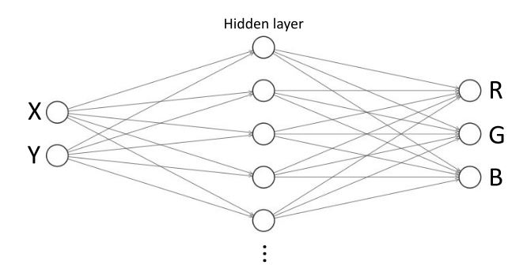

To run in localhost:

- `npm install -global http-server`
- `http-server` on this directory
- Open index.html

Insipired in: http://caza.la/synaptic/#/paint-an-image

StackOverflow question: [link]

---

# How to improve drawing accuracy of this Feedforward Neural Network (FFNN)?

I have this simple Feedforward Neural Network architecture:

For simplicity, this FFNN has 2 inputs, 15 hidden layers and 3 outputs.

And I want it to learn how to draw StackOverflow's logo:

For simplicity, this logo is 125 width by 125 height BMP at 255 colors.

The problem is

 - Librarie used: [Synaptic.js](https://caza.la/synaptic/)
 - This example in localhost [in this repo](https://github.com/adelriosantiago/paint-stackoverflow-logo-with-ml).

### Can a feedforward neural network achieve this result? If not, why? If yes, how?\*\*
