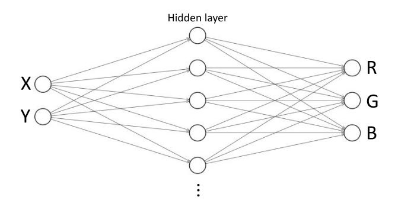

To run in localhost:

- `npm install -global http-server`
- `http-server` on this directory
- Open index.html

Insipired in: http://caza.la/synaptic/#/paint-an-image

StackOverflow question: [link]

---

# How to improve accuracy of a Feedforward Neural Network (FFNN)?

I have this simple Feedforward Neural Network architecture:

For simplicity, this FFNN has 2 inputs, 15 hidden layers and 3 outputs.

And I want it to learn how to draw StackOverflow's logo:

For simplicity, this logo is 125 width by 125 height BMP at 255 colors.

The FFNN works pretty well for simple shapes like a circle or a box.

[hidden snippet]

And the result after several thousands epochs looks pretty well:

[circle image]

However StackOverflow's logo is far more complex and even after several thousands of iterations the FFNN's results are poor:

[hidden snippet]

The best results I have obtained so far are:

[result grid]

I awarding a small bounty amount of hard-earned reputation on whoever can answer:

 1. How can I improve this FFNN drawing accuracy?
 2. Why the result I am getting is poor?
 3. (Optional) Is there an architecture that would be better suited for this kind of problem? If so, can you provide an example?

 - Library used: [Synaptic.js](https://caza.la/synaptic/)
 - This example in localhost [in this repo](https://github.com/adelriosantiago/paint-stackoverflow-logo-with-ml).